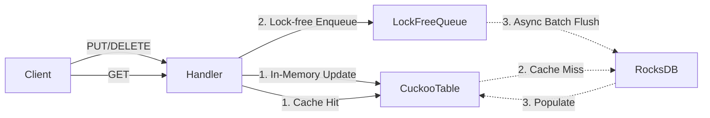

Kallisto exposes a Vault-compatible HTTP API on port **8200** with dynamic mount-based routing at `/v1/:mount/:action/:path`.

### Store a Secret

```bash
curl -X POST http://localhost:8200/v1/secret/data/myapp/db-password \
  -H "Content-Type: application/json" \
  -d '{"data":{"username":"admin","password":"super-secret-123"}}'
```

Response — version metadata:

```json
{"data":{"created_time":"2026-05-23T10:00:00.000Z","deletion_time":"","destroyed":false,"version":1}}
```

### Retrieve a Secret

```bash
curl http://localhost:8200/v1/secret/data/myapp/db-password
# Read specific version:
curl http://localhost:8200/v1/secret/data/myapp/db-password?version=1
```

Response — Vault envelope `data.data` + `data.metadata`:

```json
{
  "data": {
    "data": {"username":"admin","password":"super-secret-123"},
    "metadata": {
      "created_time": "2026-05-23T10:00:00.000Z",
      "deletion_time": "",
      "destroyed": false,
      "version": 1
    }
  }
}
```

### Delete a Secret (Soft-Delete)

```bash
# Soft-delete latest version
curl -X DELETE http://localhost:8200/v1/secret/data/myapp/db-password

# Soft-delete specific versions
curl -X POST http://localhost:8200/v1/secret/delete/myapp/db-password \
  -d '{"versions":[1,2]}'
```

Response: `204 No Content`

### Undelete (Restore)

```bash
curl -X POST http://localhost:8200/v1/secret/undelete/myapp/db-password \
  -d '{"versions":[1]}'
```

### Destroy (Permanent)

```bash
curl -X PUT http://localhost:8200/v1/secret/destroy/myapp/db-password \
  -d '{"versions":[1]}'
```

### Read Metadata

```bash
curl http://localhost:8200/v1/secret/metadata/myapp/db-password
```

### Check-and-Set (CAS)

```bash
curl -X POST http://localhost:8200/v1/secret/data/myapp/db-password \
  -d '{"options":{"cas":1},"data":{"password":"new-password"}}'
```

### Error Handling

| Status Code | Meaning                                          |
|-------------|------------------------------------------------  |
| `200`       | Success (JSON body)                              |
| `204`       | Success — no body (delete/undelete/destroy)      |
| `400`       | Bad request (CAS mismatch, missing body/versions)|
| `404`       | Secret not found / mount not found               |
| `405`       | Method not allowed for this endpoint             |
| `500`       | Internal storage error                           |
| `503`       | Queue full (write backpressure)                  |

# Persistence storage for KV engine

Kallisto by default uses **RocksDB** as a crash-safe WAL.

## Architecture Data Flow



### Write Path (Write-Behind / Eventual Consistency)

Every `PUT`/`DELETE` follows a **Write-Behind** strategy to maintain sub-10ms P99 latency, BUT, the operations are pushed into a **262,144-capacity** `LockFreeQueue`. If the queue is full, the engine will fail-fast with `EngineError::QueueFull` (HTTP 429), applying backpressure to protect its own system. 

That's mean, if you use `Kallisto` as a write-heavy system THEN you are deathly wrong. It MAY withstand the burst of writes far better than Vault, but not the sustained DDoS, nothing can. In this case, you should expect it to drop your `writes/update/delete` ops, and you should be fired because of your terrible architecture decision-making skill! Did you seriously think RocksDB can handle 100k writes/sec while running in Docker Container? Did your system DDoS your own Vault cluster?

A dedicated background worker pulls operations from the queue and flushes them to RocksDB in batches. A batch is flushed if it reaches **1024 operations** OR if **5ms** have elapsed since the last flush. (We know our software's limit, so are you. And again, don't use Kallisto as a write-heavy system!)

### Read Path (Cache-Miss Fallback)

```text
client GET
  └─► CuckooTable lookup
        ├── HIT  → return (sub-µs, in-memory)
        └── MISS → RocksDB.Get() → populate CuckooTable → return
```

The in-memory cache starts **empty** on startup, it warms up organically as traffic arrives.

### API Contract (`tl::expected`)

To support robust error handling without exceptions, all engine operations must return `tl::expected<T, EngineError>`. This enforces explicit error handling (e.g., `QueueFull`, `StorageError`, `NotFound`, `CasMismatch`) at the HTTP routing layer, mapping internal state failures cleanly to HTTP status codes.