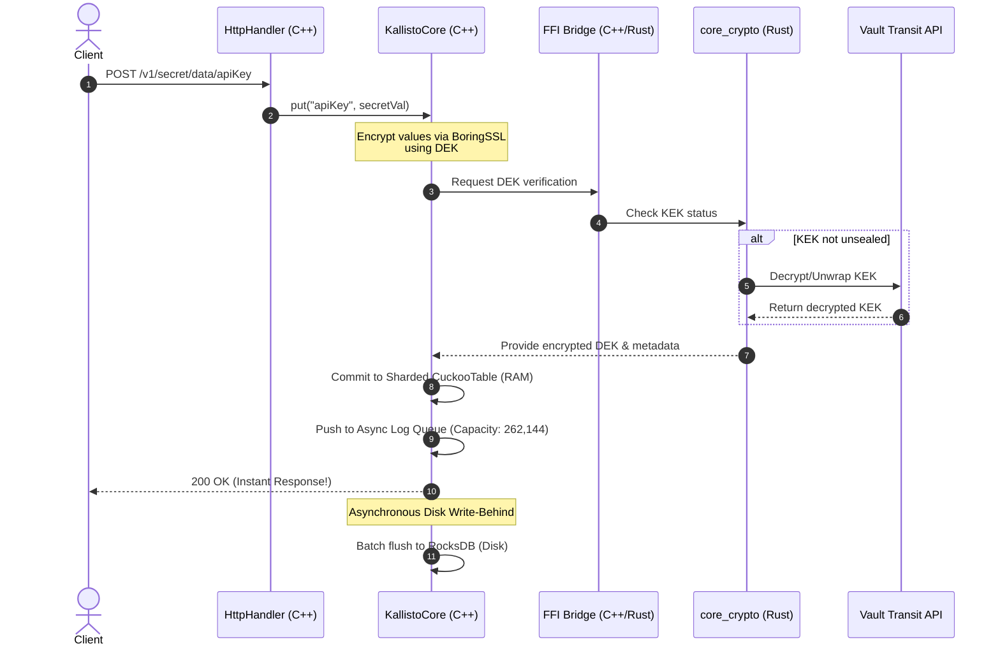

# Kallisto hoạt động như thế nào? ⚙️

Quy trình xử lý một yêu cầu lưu trữ thông tin mật (PUT/GET Secret Entry) diễn ra qua các ranh giới FFI giữa C++ và Rust:

### Các bước hoạt động cốt lõi
1.  **Tiếp nhận yêu cầu**: Cổng HTTP của C++ (Worker) nhận yêu cầu với tốc độ SIMD nhanh nhất.
2.  **Mã hóa phong bì**: Giá trị mật được mã hóa AES-256-GCM ở lớp C++ bằng khóa nội bộ DEK (Data Encryption Key).
3.  **Tách ranh giới bảo mật**: Khóa DEK được bao bọc bởi KEK (Key Encryption Key) được quản lý và lưu giữ an toàn bên phía Rust.
4.  **Phục hồi và ghi đĩa**: Dữ liệu ghi tức thời vào RAM Cache (CuckooTable) và đẩy vào hàng đợi ghi đĩa bất đồng bộ để lưu xuống RocksDB mà không chặn yêu cầu khách.
