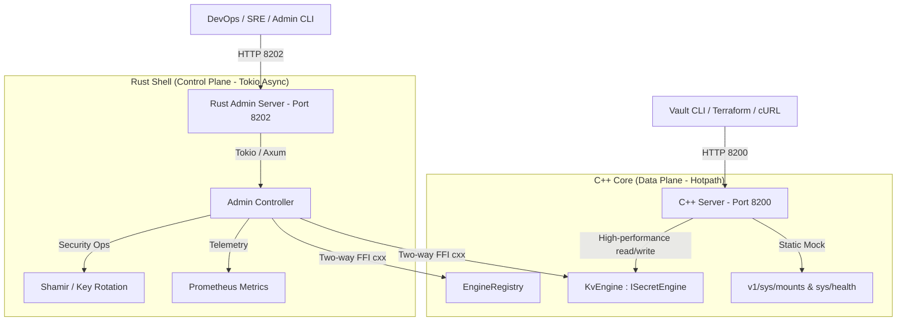

# Kế hoạch chuẩn hóa API theo Vault 2.x cho KV Engine của Kallisto
## (Bản cải tiến: Đập bỏ UDS & Tách biệt Admin Port 8202 bằng Rust Tokio)

---

## 1. Bối cảnh & Thay đổi Kiến trúc đột phá (Architectural Pivot)

Để vượt qua những rắc rối cố hữu của cơ chế Unix Domain Socket (UDS) như Zombie Socket, phân quyền file `chmod 0600` trong môi trường Docker/Kubernetes, chúng ta quyết định **đập bỏ hoàn toàn UDS**.

Kallisto sẽ chuyển dịch sang mô hình kiến trúc **Cloud-Native chuẩn chỉ (Core-Armor Pattern)** với sự tách biệt vật lý tuyệt đối giữa kênh Dữ liệu (Data Plane) và kênh Quản trị (Control Plane):



*   **Port 8200 (C++ / Data Plane):** Chịu tải chính. Chỉ phục vụ đọc/ghi/xóa dữ liệu cực hạn (GET, POST, DELETE secrets) và trả về Mock tĩnh cho `/v1/sys/mounts`, `/v1/sys/health` để đáp ứng điều kiện tương thích với Vault CLI/Terraform.
*   **Port 8202 (Rust / Control Plane):** Do **Tokio + Axum** (Rust) đảm nhận. Phục vụ toàn bộ các API quản trị hệ thống như thay đổi chế độ đồng bộ, cưỡng bức lưu đĩa (`SAVE`), unseal và rotate keys.

> [!TIP]
> **Bảo mật tuyệt đối:** Cổng `8202` mặc định chỉ bind vào `127.0.0.1` (hoặc cấu hình qua file `kallisto.hcl`) để đảm bảo chỉ có các tiến trình cục bộ hoặc Kubernetes sidecar/operator mới có quyền gọi các API quản trị này.

---

## 2. Đặc tả Phân chia API Cổng 8200 (Dân sự/Data) vs Cổng 8202 (Vận hành/Admin)

Để bảo mật tuyệt đối hệ thống mà vẫn duy trì tính tương thích tối đa, Kallisto phân chia toàn bộ danh sách 15 endpoints trong đặc tả Vault KV-v2 và các endpoint hệ thống thành hai nhóm vật lý rõ rệt:

### A. Cổng Dữ liệu 8200 (C++ Epoll Server - Civilian Data Plane)
Đảm nhận các tác vụ runtime tốc độ cao (Hotpath), xử lý đọc/ghi và quản lý vòng đời phiên bản dữ liệu. Được tối ưu hóa bằng Epoll và ShardedCuckooTable, không bao giờ bị block bởi khóa quản trị:

| Phương thức | Endpoint | Mô tả chi tiết hành vi | Trạng thái HTTP |
| :--- | :--- | :--- | :--- |
| `GET` | `/v1/sys/mounts` | **Mock:** Trả về danh sách engine mặc định (chứa `secret/` loại `kv` v2) | `200 OK` |
| `GET` | `/v1/sys/health` | **Mock:** Báo cáo trạng thái unsealed, active để CLI/Terraform khởi tạo | `200 OK` |
| `GET` | `/v1/sys/seal-status` | **Mock:** Trả về cấu trúc unsealed status không cần xác thực | `200 OK` |
| `GET` | `/v1/:mount/data/:path` | **Đọc Secret Version:** Trả về data + metadata của version chỉ định (`?version=N`) | `200 OK` (hoặc `404` nếu bị xóa/hủy) |
| `POST` | `/v1/:mount/data/:path` | **Ghi Secret Phiên bản mới:** Tạo version mới, kiểm tra `options.cas` Check-And-Set | `200 OK` (hoặc `400` nếu lệch CAS) |
| `PATCH` | `/v1/:mount/data/:path` | **Patch Secret:** Cập nhật một phần dữ liệu bằng JSON Merge Patch | `200 OK` (yêu cầu Content-Type Merge Patch) |
| `GET` | `/v1/:mount/subkeys/:path` | **Đọc Subkeys:** Trả về cây thư mục khóa con với bộ lọc độ sâu `depth` | `200 OK` |
| `DELETE` | `/v1/:mount/data/:path` | **Soft-Delete phiên bản mới nhất:** Đánh dấu ngắt kích hoạt phiên bản gần nhất | `204 No Content` |
| `POST` | `/v1/:mount/delete/:path` | **Soft-Delete các phiên bản cụ thể:** Payload chứa danh sách `versions` cần ẩn | `204 No Content` |
| `POST` | `/v1/:mount/undelete/:path` | **Khôi phục phiên bản:** Phục hồi các phiên bản đã bị soft-delete trước đó | `204 No Content` |
| `PUT` | `/v1/:mount/destroy/:path` | **Hủy vĩnh viễn (Destroy):** Ghi đè rỗng (Wipe) vĩnh viễn dữ liệu nhạy cảm của version | `204 No Content` |
| `LIST` / `GET` | `/v1/:mount/metadata/:path` | **List Keys:** Liệt kê danh sách các khóa con bên dưới thư mục chỉ định | `200 OK` (LIST hoặc GET với `list=true`) |
| `GET` | `/v1/:mount/metadata/:path` | **Đọc Key Metadata:** Lấy lịch sử tất cả phiên bản (created_time, deletion_time, destroyed) | `200 OK` |

### B. Cổng Quản trị 8202 (Rust Tokio Server - Admin/Control Plane)
Đảm nhận toàn bộ các tác vụ thay đổi cấu hình, can thiệp siêu dữ liệu (metadata), hoặc các tác vụ bảo mật hệ thống phá hủy mạnh. Cổng này chặn đứng mọi truy cập mạng công cộng bên ngoài:

| Phương thức | Endpoint | Mô tả chi tiết hành vi | Hành động xuyên FFI / Nội bộ Rust |
| :--- | :--- | :--- | :--- |
| `POST` | `/v1/:mount/config` | **Cấu hình Engine:** Đặt giới hạn `max_versions`, `cas_required`, `delete_version_after` | Cập nhật config của Engine trong C++ Registry |
| `GET` | `/v1/:mount/config` | **Đọc cấu hình Engine:** Trả về giới hạn cấu hình hiện tại của mount point | Truy vấn cấu hình từ C++ Registry |
| `POST` | `/v1/:mount/metadata/:path` | **Tạo/Cập nhật Metadata của Key:** Đặt cấu hình riêng biệt từng key, thêm `custom_metadata` | Cập nhật cấu hình metadata của Key đó |
| `PATCH` | `/v1/:mount/metadata/:path` | **Patch Metadata của Key:** Cập nhật một phần các trường siêu dữ liệu custom | Cập nhật cấu hình metadata của Key đó |
| `DELETE` | `/v1/:mount/metadata/:path` | **Xóa sạch Key & Lịch sử:** Xóa vĩnh viễn toàn bộ metadata và tất cả phiên bản dữ liệu | Gửi lệnh hủy triệt để Key khỏi Cuckoo và RocksDB |
| `POST` | `/v1/sys/mounts/:path` | **Mount Engine mới:** Đăng ký mount động một engine (ví dụ mount thêm `shared/` loại `kv`) | Thêm Engine thực thể vào C++ EngineRegistry |
| `DELETE` | `/v1/sys/mounts/:path` | **Unmount Engine:** Gỡ bỏ một engine và giải phóng bộ nhớ của nó | Gỡ Engine thực thể khỏi C++ EngineRegistry |
| `POST` | `/v1/sys/seal` | **Seal Server:** Khóa hệ thống lập tức, chuyển trạng thái về locked, bảo vệ RAM | Chuyển trạng thái Cryptographic Shell sang Sealed |
| `POST` | `/v1/sys/unseal` | **Unseal Server:** Cung cấp Shamir Key Shard để mở khóa và nạp Master Key | Thực hiện Unseal, nạp key giải mã vào bộ nhớ RAM |
| `POST` | `/admin/save` | **Force Flush:** Cưỡng bức xả hàng loạt ghi từ Cuckoo Queue xuống RocksDB | Gọi FFI: `kallisto::rust::ffi::force_flush_engine()` |
| `POST` | `/admin/mode/batch` | **Change Sync mode:** Chuyển sang lưu trữ bất đồng bộ tốc độ cao (Batch) | Gọi FFI: `kallisto::rust::ffi::change_sync_mode(1)` |
| `POST` | `/admin/mode/immediate` | **Change Sync mode:** Chuyển sang lưu trữ đồng bộ nghiêm ngặt (Immediate) | Gọi FFI: `kallisto::rust::ffi::change_sync_mode(0)` |
| `GET` | `/admin/status` | **Server Diagnostics:** Xem trạng thái hiệu năng, kích thước cache, thông lượng | Truy vấn trực tiếp qua FFI từ C++ Core |

---

## 3. Thiết kế Cầu nối FFI Hai Chiều với `cxx`

Để Rust Port 8202 có thể điều khiển C++ Engine Core, chúng ta mở rộng `#[cxx::bridge]` trong `rust_integrates/ffi_bridge/src/lib.rs` để cho phép gọi trực tiếp các phương thức C++:

```rust
#[cxx::bridge(namespace = "kallisto::rust")]
pub mod ffi {
    // Các hàm Rust xuất bản cho C++ gọi (Ví dụ check status từ Rust)
    extern "Rust" {
        fn get_rust_version() -> String;
        fn initialize_security_shell() -> bool;
    }

    // Các hàm C++ xuất bản cho Rust gọi (Để điều khiển Data Plane)
    unsafe extern "C++" {
        include!("kallisto/engine/i_secret_engine.hpp");
        
        // Kích hoạt manual save từ Rust
        fn force_flush_engine() -> bool;
        
        // Thay đổi SyncMode: 0 = IMMEDIATE, 1 = BATCH
        fn change_sync_mode(mode: i32) -> bool;
    }
}
```

Phía C++ sẽ triển khai (implement) các hàm này để ánh xạ trực tiếp đến facade `KallistoCore` toàn cục hoặc thông qua con trỏ EngineRegistry.

---

## 4. Kế hoạch Hành động Từng bước (Execution Step-by-Step)

### Pha 1: Đập bỏ UDS & Dọn dẹp C++ Code
1.  Xóa bỏ file `uds_admin_handler.hpp` và `uds_admin_handler.cpp` khỏi cây thư mục `src/server/`.
2.  Gỡ bỏ việc khởi tạo và quản lý `UdsAdminHandler` trong `src/kallisto_server.cpp`.
3.  Cập nhật `CMakeLists.txt` để loại bỏ các tệp tin này khỏi danh sách biên dịch.

### Pha 2: Xây dựng Admin HTTP Server trên Rust (Port 8202)
1.  Bổ sung dependency `axum` (hoặc `hyper`) và `tokio` vào `rust_integrates/control_plane/Cargo.toml`.
2.  Khởi tạo một background async server trên cổng `8202` bên trong hàm `initialize_security_shell()` của Rust.
3.  Tạo các router handler cho:
    *   `POST /admin/save` -> Gọi FFI C++ `force_flush_engine()`.
    *   `POST /admin/mode/batch` -> Gọi FFI C++ `change_sync_mode(1)`.
    *   `POST /admin/mode/immediate` -> Gọi FFI C++ `change_sync_mode(0)`.

### Pha 3: Triển khai FFI Hai chiều (`cxx`)
1.  Cập nhật file `rust_integrates/ffi_bridge/src/lib.rs` với các hàm `extern "C++"` như đặc tả ở Mục 3.
2.  Viết file triển khai các hàm FFI này trong thư mục `src/engine/` của C++, kết nối chúng với instance `KallistoCore` đang chạy.

### Pha 4: Chuẩn hóa API KV-v2 và Mock Hệ thống trên Cổng 8200 (C++)
1.  Bổ sung Mock tĩnh cho `/v1/sys/mounts` và `/v1/sys/health` trên lớp định tuyến của `HttpHandler`.
2.  Hiện thực hóa cấu trúc JSON envelope cho các kết quả trả về của các endpoint dữ liệu.
3.  Tích hợp logic kiểm tra Check-And-Set (`cas`) khi thực hiện cập nhật ghi mới.

---

## 5. Kết luận

Ý tưởng đập bỏ UDS và tách riêng kênh Admin sang cổng `8202` do Rust Tokio quản lý là một **bước đi kiến trúc cực kỳ đột phá**. Nó giúp:
*   Loại bỏ 100% các rủi ro hệ điều hành liên quan đến socket file.
*   Giải phóng tài nguyên C++ hoàn toàn cho các epoll threads để đảm bảo hiệu năng tối thượng.
*   Khai thác triệt để sức mạnh bất đồng bộ, tính an toàn và tiện lợi của thư viện HTTP phía Rust (Axum/Tokio).
*   Giữ vững tính tương thích của cổng 8200 với các tool tiêu chuẩn như Vault CLI hay Terraform.
